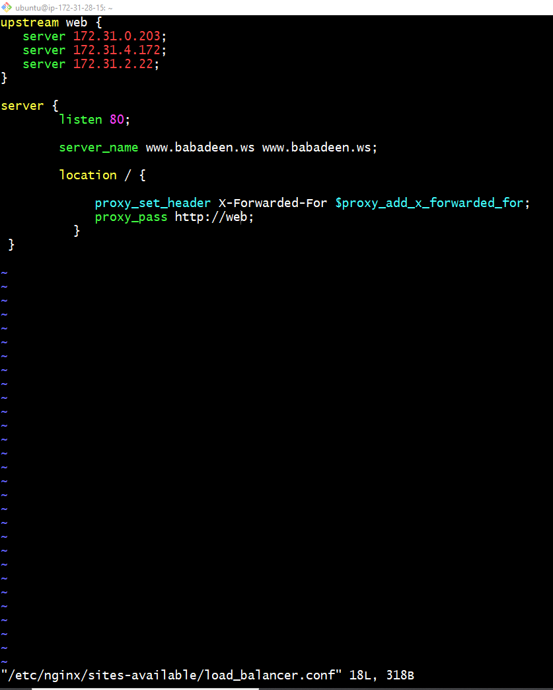
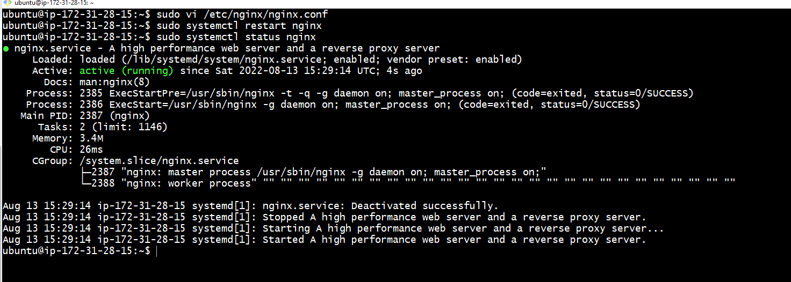
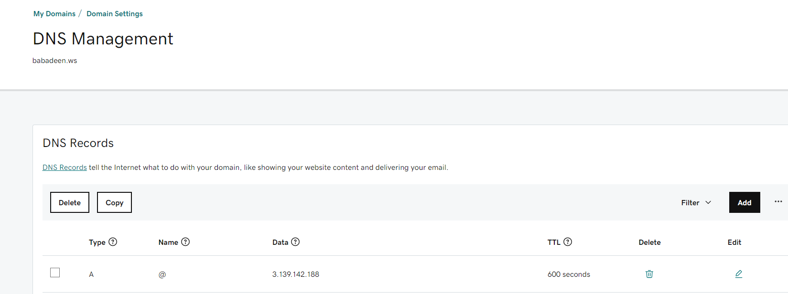
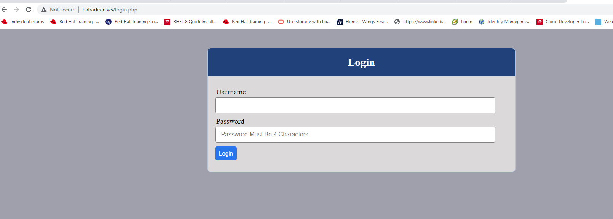
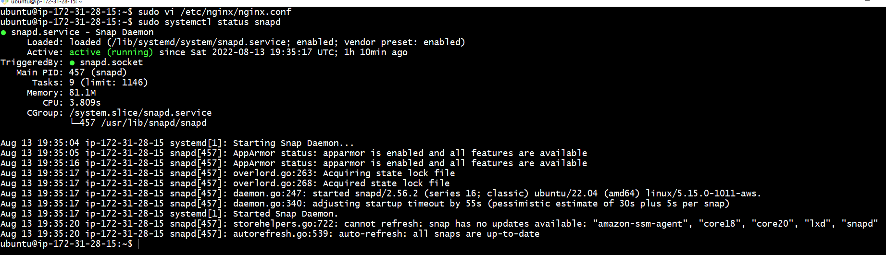
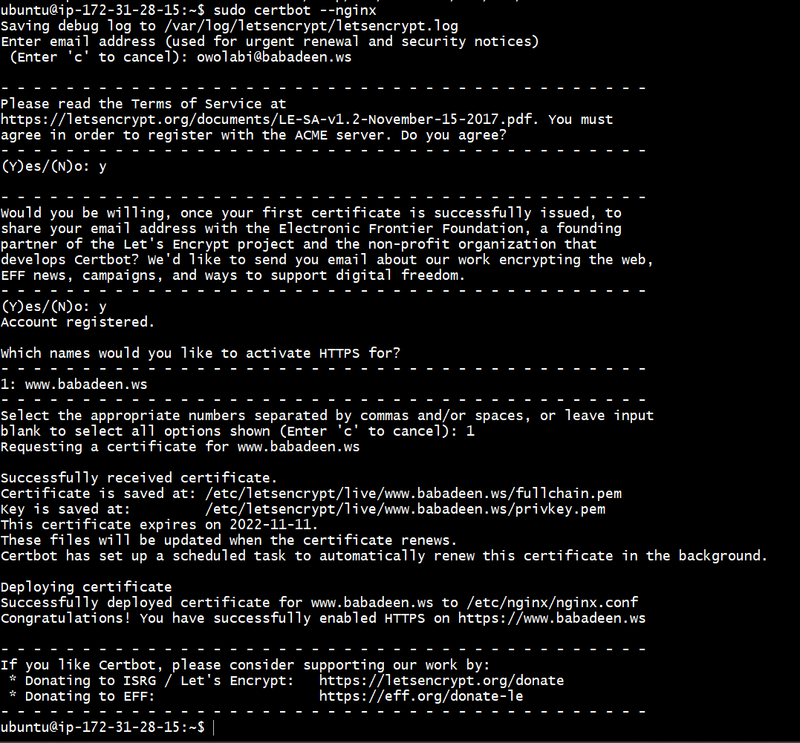
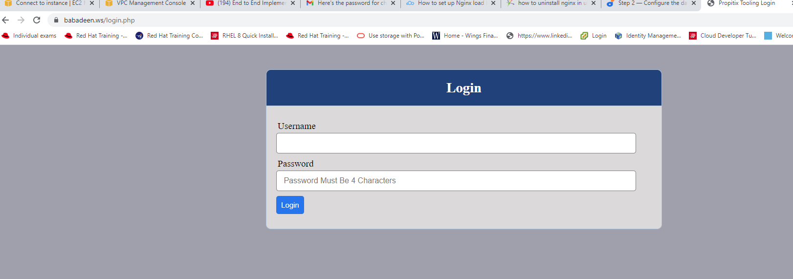
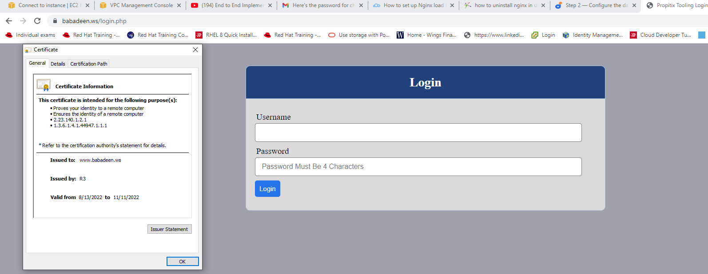
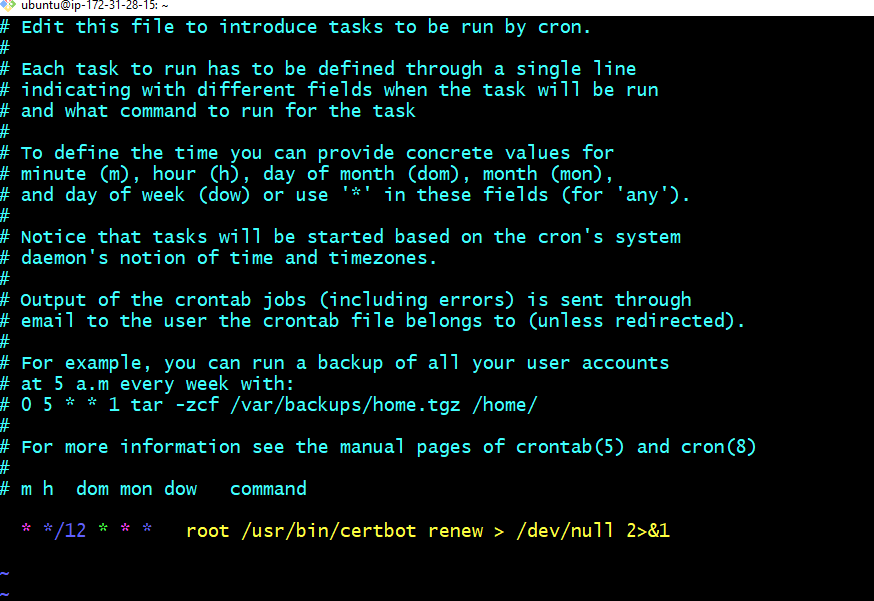

# LOAD BALANCER SOLUTION WITH NGINX AND SSL/TLS

### Task -- This project consists of two parts:

* Configure Nginx as a Load Balancer
* Register a new domain name and configure secured connection using SSL/TLS certificates

### I Configured NGINX as a Loadbalancer

* I Created an EC2 VM based on Ubuntu Server 20.04 LTS and name it Nginx LB 
* I opened TCP port 80 and 443 
* I Updated /etc/hosts file for local DNS with Web Servers’ names (e.g. Web1,Web2  and web3) and their local IP addresses 
* I Installed and configured Nginx as a load balancer to point traffic to the resolvable DNS names of the webservers

### I Updated the instance and Installed Nginx below

` sudo apt update `
` sudo apt install nginx `

### To Configure Nginx LB using Web Servers’ ips defined in /etc/hosts

* I created a new file ---   /etc/nginx/sites-available/load_balancer.conf to insert the below using vi editor

` sudo vi /etc/nginx/sites-available/load_balancer.conf `

* And copied the configuratio script, saved and exit
# upstream web {
    server 172.31.0.203;
    server 172.31.4.172;
    server 172.31.2.22;
  }

# server {
    listen 80;
    server_name www.babadeen.ws;
    location / {
      proxy_set_header X-Forwarded-For $proxy_add_x_forwarded_for; 
      proxy_pass http://web;
    }
  } 

### Restarted Nginx verified service is up and running

` sudo systemctl restart nginx `

` sudo systemctl status nginx `

### REGISTERED A NEW DOMAIN NAME AND CONFIGURED SECURED CONNECTION USING SSL/TLS CERTIFICATES

* babadeen.ws was registed and also secured with Godaddy

* I assigned an Elastic IP to my Nginx LB server and also to my domain name with this Elastic IP  -- 3.134.150.221

* I Updated A record in my registrar to point to Nginx LB using Elastic IP address

* I Checked that Web Servers can be reached from my browser using new domain name using HTTP protocol – http://babadeen.ws

* I Configured Nginx to recognize my new domain name by updating my  load_balancer.conf with server_name www.babadeen.ws 

* I Installed certbot and requested for an SSL/TLS certificate

* I also verified snapd service is active and running

` sudo systemctl status snapd `

* I configured and installed the certbot with the following commands below

`  sudo apt install certbot -y `

` sudo apt install python3-certbot-nginx -y ` 

`  sudo nginx -t && sudo nginx -s reload ` 

`  sudo certbot --nginx -dbabadeen.ws -d www.babadeen.ws `

* another way to do it below 
 
` sudo snap install --classic certbot  `

* Requesting my certificate, domain name already updated in nginx.conf

` sudo ln -s /snap/bin/certbot /usr/bin/certbot `
` sudo certbot --nginx ` 

* I Tested my  secured access to my Web Solution by trying to reach https://babadeen.ws

* I Clicked on the padlock icon to see the details of the certificate issued for my website.

### Setting up periodical renewal of my SSL/TLS certificate 

* By default, LetsEncrypt certificate is valid for 90 days, so it is recommended to renew it at least every 60 days or more frequently.

* testing with dry-run mode

` sudo certbot renew --dry-run `

 *  I configured a cronjob to run the command twice a day by editing  the crontab file with the following command:

` crontab -e `
* Adding following line:

` * */12 * * *   root /usr/bin/certbot renew > /dev/null 2>&1

